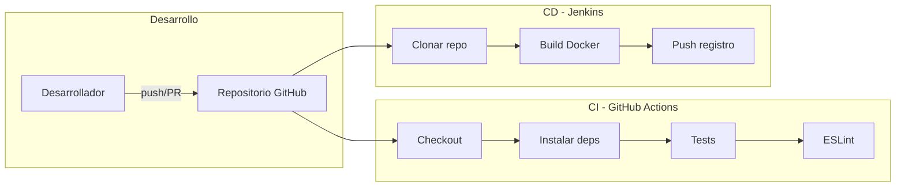

# Documento técnico: Pipeline CI/CD para aplicación NestJS

**Laboratorio técnico – Actividad 3 – Fundamentos de DevOps**

---

## 1. Tecnologías seleccionadas y justificación

Las siguientes herramientas se han elegido para cubrir el ciclo de vida del software (desarrollo, integración, entrega y despliegue) y están alineadas con los objetivos del laboratorio.

| Tecnología        | Rol en el ciclo de vida | Justificación breve |
|-------------------|--------------------------|----------------------|
| **NestJS**        | Desarrollo               | Framework backend en Node.js con estructura clara, soporte TypeScript y pruebas integradas (Jest), adecuado para APIs y equipos que siguen convenciones. |
| **Node.js**       | Desarrollo / ejecución   | Entorno de ejecución común para NestJS; versión 20 LTS asegura soporte y consistencia en desarrollo, CI y contenedores. |
| **Git / GitHub**  | Control de versiones     | Git es el estándar para versionado; GitHub aloja el código y permite integrar GitHub Actions de forma nativa para CI. |
| **GitHub Actions**| Integración continua (CI)| Servicio de CI/CD integrado en GitHub; se ejecuta en cada push/PR, no requiere servidor propio y permite definir workflows en YAML (checkout, build, test, lint). |
| **Jenkins**       | Entrega continua (CD)    | Servidor de automatización maduro y flexible; permite definir pipelines (Jenkinsfile) para construir imágenes Docker y publicarlas en un registro, con control sobre cuándo y cómo se despliega. |
| **Docker**        | Empaquetado / despliegue | Contenedores ofrecen un artefacto reproducible (imagen) que se puede ejecutar en cualquier entorno compatible; facilita consistencia entre desarrollo, staging y producción. |
| **ESLint**        | Calidad de código (CI)   | Análisis estático incluido en el proyecto NestJS; en el pipeline CI detecta problemas de estilo y posibles errores antes de integrar código. |

La selección está actualizada (Node 20, NestJS 11, acciones recientes de GitHub) y permite cumplir los requisitos del laboratorio: CI con compilación, pruebas y validación, y CD con construcción y publicación de imagen Docker.

---

## 2. Arquitectura e integración

En el flujo implementado, el código se aloja en GitHub. Dos mecanismos lo utilizan de forma paralela o complementaria:

- **GitHub Actions** se encarga del CI: cada push o pull request dispara un workflow que hace checkout, instala dependencias, ejecuta tests y lint. Si algo falla, el commit o el PR no se consideran listos para integrar.
- **Jenkins** se encarga del CD: mediante un job de tipo “Pipeline from SCM” que usa el Jenkinsfile del repositorio, clona el código, construye la imagen Docker y la publica en un registro (p. ej. Docker Hub). Ese artefacto puede usarse luego para desplegar en Kubernetes u otro entorno.

El siguiente diagrama resume el flujo y la integración entre componentes.

- **Desarrollo:** El desarrollador hace push o abre un pull request contra el repositorio en GitHub.
- **CI:** GitHub Actions ejecuta checkout, instalación de dependencias, pruebas unitarias y análisis estático. El resultado (éxito/fallo) se muestra en la pestaña Actions y en el estado del commit/PR.
- **CD:** Jenkins (cuando está configurado) clona el repo, construye la imagen con el Dockerfile y la publica en el registro. La imagen queda lista para ser usada en despliegues posteriores.

---

## 3. Aporte de cada herramienta a la eficiencia operativa y colaboración (DevOps)

- **GitHub Actions (CI)**  
  Automatiza la verificación del código en cada cambio. Esto reduce la carga manual de “¿compila y pasan los tests?” y permite detectar fallos pronto (feedback rápido). La colaboración mejora porque todo el equipo ve el estado del pipeline en cada commit y PR, y se evita integrar código roto a la rama principal.

- **Jenkins (CD)**  
  Centraliza la construcción y publicación de artefactos (en este caso, la imagen Docker). Permite definir políticas de cuándo desplegar, repetir el mismo proceso en cada ejecución y auditar qué versión se construyó. En escenarios reales, el mismo Jenkinsfile puede extenderse para desplegar a entornos (staging, producción) o para integrarse con Kubernetes en fases posteriores del curso.

- **Docker y registro de imágenes**  
  La aplicación se empaqueta en una imagen reproducible. Cualquier entorno que tenga Docker (o un orquestador que use imágenes) puede ejecutar la misma versión sin depender de “en mi máquina funciona”. Eso alinea desarrollo y operaciones (principio DevOps) y facilita despliegues consistentes y rollbacks por versión de imagen.

- **ESLint en el pipeline**  
  El análisis estático en CI unifica criterios de calidad y estilo en el repositorio. Los problemas se corrigen antes de merge, lo que mantiene el código más limpio y reduce deuda técnica.

En conjunto, las herramientas implementadas apoyan integración continua (código validado automáticamente), entrega continua (artefacto listo para desplegar) y colaboración (visibilidad y estándares compartidos), alineados con los principios DevOps.

---

## 4. Relación con escenarios reales o profesionales

- **Equipo que hace varios PR al día:** El pipeline de GitHub Actions se ejecuta en cada push y en cada PR. Si un desarrollador sube código que no compila o que rompe tests, el estado del PR aparece en rojo y el equipo puede corregir antes de hacer merge. Así se evita romper la rama principal y se mantiene un historial de commits estable.

- **Despliegue en distintos entornos:** Con el pipeline CD en Jenkins, cada ejecución genera una imagen Docker etiquetada (p. ej. con el número de build). Esa misma imagen puede desplegarse en un entorno de pruebas y, tras validación, en producción, garantizando que lo que se prueba es lo que se despliega (misma imagen, mismos binarios).

- **Onboarding de nuevos miembros:** Tener un CI que ejecuta tests y lint, y un Jenkinsfile que define los pasos de construcción y publicación, documenta de forma ejecutable cómo se valida y empaqueta la aplicación. Un nuevo miembro puede ver el flujo en el código (workflows y Jenkinsfile) y replicarlo localmente o en su entorno.

- **Trabajo con Kubernetes (fases posteriores):** La imagen publicada en un registro es el artefacto que Kubernetes suele consumir (por ejemplo, en un Deployment). La configuración actual de CD (clonar, construir imagen, publicar) es la base para después añadir stages de despliegue a un cluster K8s desde Jenkins o desde otra herramienta.

---

## 5. Resumen

Se ha configurado un pipeline de **CI** con GitHub Actions (checkout, instalación de dependencias, pruebas y análisis estático) que se ejecuta en cada push y pull request, y un pipeline de **CD** definido en un Jenkinsfile con tres stages: clonar repositorio, construir imagen Docker y publicar en un registro. Las tecnologías elegidas (NestJS, Node.js, GitHub, GitHub Actions, Jenkins, Docker, ESLint) están justificadas en el ciclo de vida del software y se han representado en un diagrama de flujo. El documento explica cómo cada una aporta a la eficiencia operativa y a la colaboración en un contexto DevOps, y se han relacionado con escenarios reales o profesionales (múltiples PR, varios entornos, onboarding y evolución hacia Kubernetes).

Para los archivos de configuración y la descripción del flujo en el repositorio, consultar el [README.md](../README.md) y los archivos [.github/workflows/ci.yml](../.github/workflows/ci.yml), [Jenkinsfile](../Jenkinsfile) y [Dockerfile](../Dockerfile).
