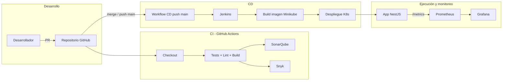

# Documento técnico: Pipeline CI/CD para aplicación NestJS

**Laboratorio técnico – Actividad 3 – Fundamentos de DevOps**

---

## 1. Tecnologías seleccionadas y justificación

Las siguientes herramientas se han elegido para cubrir el ciclo de vida del software (desarrollo, integración, entrega, despliegue, seguridad y monitoreo) y están alineadas con los objetivos del laboratorio.

| Tecnología        | Rol en el ciclo de vida | Justificación breve |
|-------------------|--------------------------|----------------------|
| **NestJS**        | Desarrollo               | Framework backend en Node.js con estructura clara, soporte TypeScript y pruebas integradas (Jest), adecuado para APIs y equipos que siguen convenciones. |
| **Node.js**       | Desarrollo / ejecución   | Entorno de ejecución común para NestJS; versión 20 LTS asegura soporte y consistencia en desarrollo, CI y contenedores. |
| **Git / GitHub**  | Control de versiones     | Git es el estándar para versionado; GitHub aloja el código y permite integrar GitHub Actions de forma nativa para CI. |
| **GitHub Actions**| Integración continua (CI) y disparo de CD | Se ejecuta en cada pull request (CI: build, test, lint, SonarQube, Snyk) y en cada push a main (workflow CD que dispara a Jenkins). La rama main está protegida; los cambios entran solo por PR. |
| **Jenkins**       | Entrega continua (CD)    | Pipeline (Jenkinsfile) que construye la imagen Docker en el entorno de Minikube y despliega en Kubernetes con `kubectl apply`. Se ejecuta al ser invocado por el workflow CD de GitHub Actions. |
| **Docker**        | Empaquetado / despliegue | Contenedores ofrecen un artefacto reproducible (imagen) que se ejecuta en Minikube; facilita consistencia entre desarrollo y entorno local de pruebas. |
| **Kubernetes (Minikube)** | Orquestación local | Cluster local para desplegar la aplicación y las herramientas de monitoreo (Prometheus, Grafana); manifiestos en `k8s/` y `k8s/monitoring/`. |
| **SonarQube**     | Seguridad y calidad (CI) | Análisis de código (bugs, vulnerabilidades, code smells, cobertura); se ejecuta en el pipeline CI mediante un job en self-hosted runner que envía resultados al SonarQube en Docker. |
| **Snyk**          | Seguridad dependencias (CI) | Análisis de vulnerabilidades en dependencias npm; integrado como job en GitHub Actions. |
| **Prometheus**    | Monitoreo                | Recolecta métricas de la aplicación (endpoint `/metrics`) y de sí mismo; desplegado en el cluster. |
| **Grafana**       | Visualización            | Dashboards (p. ej. NodeJS Application Dashboard) con métricas de CPU, memoria, event loop y requests; datasource Prometheus. |
| **ESLint**        | Calidad de código (CI)   | Análisis estático en el pipeline CI; detecta problemas de estilo y posibles errores antes de integrar código. |

La selección cubre CI (compilación, pruebas, lint, SonarQube, Snyk), CD (Jenkins con despliegue en Kubernetes), seguridad (SonarQube, Snyk) y monitoreo (Prometheus, Grafana).

---

## 2. Arquitectura e integración

En el flujo implementado, el código se aloja en GitHub. La rama `main` está protegida: los cambios entran solo mediante pull request. El CI se ejecuta en cada PR; el CD se dispara al hacer push a `main` (por ejemplo al mergear el PR).

- **GitHub Actions (CI):** En cada pull request se ejecuta un workflow con varios jobs: (1) build, pruebas unitarias y e2e, lint y compilación, en runners de GitHub; (2) análisis SonarQube en un self-hosted runner (para conectar con SonarQube en Docker local); (3) análisis Snyk de dependencias. Si algún paso falla, el PR no se puede mergear.
- **GitHub Actions (CD):** Un segundo workflow, disparado solo por push a `main`, ejecuta en el self-hosted runner una llamada a la API de Jenkins para lanzar el pipeline de CD.
- **Jenkins (CD):** El job configurado con el Jenkinsfile clona el repositorio, construye la imagen Docker en Minikube y aplica `kubectl apply -f k8s/`. La aplicación queda desplegada en el cluster. En `k8s/monitoring/` se despliegan además Prometheus y Grafana.

El siguiente diagrama resume el flujo y la integración entre componentes.

```mermaid
flowchart LR
  subgraph dev [Desarrollo]
    Dev[Desarrollador]
    Git[Repositorio GitHub]
  end
  subgraph ci [CI - GitHub Actions]
    Checkout[Checkout]
    Test[Tests + Lint + Build]
    Sonar[SonarQube]
    Snyk[Snyk]
  end
  subgraph cd [CD]
    Trigger[Workflow CD push main]
    Jenkins[Jenkins]
    Build[Build imagen Minikube]
    K8s[Despliegue K8s]
  end
  subgraph run [Ejecución y monitoreo]
    App[App NestJS]
    Prom[Prometheus]
    Grafana[Grafana]
  end
  Dev -->|PR| Git
  Git --> Checkout --> Test --> Sonar
  Test --> Snyk
  Git -->|merge / push main| Trigger --> Jenkins --> Build --> K8s --> App
  App -->|/metrics| Prom --> Grafana
```

- **Desarrollo:** El desarrollador trabaja en una rama y abre un pull request hacia `main`.
- **CI:** GitHub Actions ejecuta tests, lint, build, SonarQube (en self-hosted) y Snyk. El estado se muestra en el PR; solo con CI en verde se puede mergear.
- **CD:** Al mergear (push a `main`), el workflow CD invoca a Jenkins. Jenkins construye la imagen en Minikube y despliega con `kubectl apply`. La aplicación queda disponible en el cluster.
- **Monitoreo:** La aplicación expone `/metrics`; Prometheus hace scrape y Grafana visualiza las métricas en dashboards (p. ej. NodeJS Application Dashboard).

---

## 3. Aporte de cada herramienta a la eficiencia operativa y colaboración (DevOps)

- **GitHub Actions (CI)**  
  Automatiza la verificación del código en cada cambio. Esto reduce la carga manual de “¿compila y pasan los tests?” y permite detectar fallos pronto (feedback rápido). La colaboración mejora porque todo el equipo ve el estado del pipeline en cada commit y PR, y se evita integrar código roto a la rama principal.

- **Jenkins (CD)**  
  Centraliza la construcción de la imagen Docker en Minikube y el despliegue en Kubernetes. Permite repetir el mismo proceso en cada ejecución y auditar qué versión se desplegó. El pipeline se dispara desde GitHub Actions al mergear a main, cerrando el ciclo CI/CD.

- **SonarQube y Snyk**  
  SonarQube aporta análisis de calidad de código (bugs, vulnerabilidades, code smells, cobertura) integrado en el CI; Snyk analiza las dependencias npm. Ambos permiten identificar y corregir problemas antes de integrar código a main, mejorando la seguridad y el mantenimiento.

- **Kubernetes (Minikube) y Docker**  
  La aplicación se empaqueta en una imagen reproducible. Se despliega en un cluster local (Minikube). Eso alinea desarrollo y operaciones (principio DevOps) y facilita despliegues consistentes y rollbacks por versión de imagen.

- **Prometheus y Grafana**  
  Prometheus recolecta métricas de la aplicación (endpoint `/metrics`) y de sí mismo; Grafana permite visualizar dashboards (p. ej. NodeJS Application Dashboard) con CPU, memoria, event loop y requests. El monitoreo facilita detectar degradación y tomar decisiones con datos.

- **ESLint en el pipeline**  
  El análisis estático en CI unifica criterios de calidad y estilo en el repositorio. Los problemas se corrigen antes de merge, lo que mantiene el código más limpio y reduce deuda técnica.

En conjunto, las herramientas implementadas apoyan integración continua (código validado y analizado en seguridad), entrega continua (despliegue automatizado en Kubernetes), monitoreo (Prometheus y Grafana) y colaboración (visibilidad y estándares compartidos), alineados con los principios DevOps.

---

## 4. Relación con escenarios reales o profesionales

- **Equipo que hace varios PR al día:** El CI se ejecuta en cada pull request (tests, lint, SonarQube, Snyk). Si el código no compila o no pasa las validaciones, el estado del PR aparece en rojo y el equipo puede corregir antes de hacer merge. La rama `main` está protegida, por lo que solo se integra código que ha pasado el pipeline.

- **Despliegue automatizado:** Al mergear a `main`, el workflow CD dispara a Jenkins, que construye la imagen en Minikube y despliega en Kubernetes. La misma imagen que se probó en CI es la que se despliega, garantizando consistencia entre validación y ejecución.

- **Onboarding y documentación:** Los workflows de GitHub Actions, el Jenkinsfile, los manifiestos en `k8s/` y la configuración de SonarQube, Snyk, Prometheus y Grafana documentan de forma ejecutable cómo se valida, construye, despliega y monitorea la aplicación. Un nuevo miembro puede replicar el entorno local (Minikube, Jenkins en Docker, SonarQube en Docker) y seguir el flujo completo.

- **Monitoreo y observabilidad:** Con Prometheus y Grafana desplegados en el cluster, el equipo puede visualizar métricas de la aplicación (CPU, memoria, event loop, requests) en dashboards como el NodeJS Application Dashboard, lo que permite detectar problemas y tomar decisiones basadas en datos.

---

## 5. Resumen

Se ha configurado un pipeline de **CI** con GitHub Actions (checkout, pruebas, lint, build, SonarQube y Snyk) que se ejecuta en cada pull request, y un pipeline de **CD** que se dispara al hacer push a `main` (workflow que invoca a Jenkins) y que construye la imagen en Minikube y despliega en Kubernetes. Se han integrado **SonarQube** y **Snyk** para análisis de código y dependencias, y **Prometheus** y **Grafana** para monitoreo (métricas de la aplicación y dashboards). Las tecnologías elegidas (NestJS, Node.js, GitHub, GitHub Actions, Jenkins, Docker, Kubernetes/Minikube, SonarQube, Snyk, Prometheus, Grafana, ESLint) están justificadas en el ciclo de vida del software y se han representado en un diagrama de flujo. El documento explica cómo cada una aporta a la eficiencia operativa, la seguridad y la colaboración en un contexto DevOps, y se han relacionado con escenarios reales (PR, despliegue automatizado, onboarding, monitoreo).

Para los archivos de configuración y la descripción del flujo en el repositorio, consultar el [README.md](../README.md), [EVIDENCIAS.md](../EVIDENCIAS.md), y los archivos [.github/workflows/ci.yml](../.github/workflows/ci.yml), [.github/workflows/cd.yml](../.github/workflows/cd.yml), [Jenkinsfile](../Jenkinsfile), [Dockerfile](../Dockerfile) y los manifiestos en [k8s/](../k8s/) y [k8s/monitoring/](../k8s/monitoring/).
